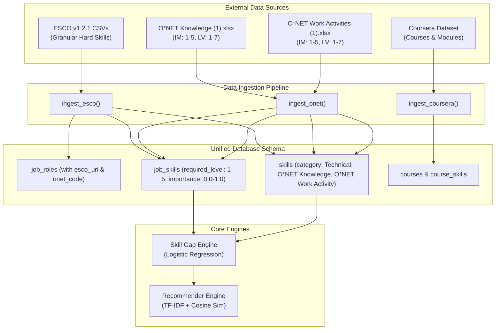

# Hybrid ESCO + O*NET Dual-Taxonomy Integration Plan

## Executive Summary
This plan details the technical architecture, data mapping, ETL pipeline, and API enhancements to combine **ESCO v1.2.1** and **O\*NET** into a unified, complementary skill gap and learning recommendation platform.

- **ESCO v1.2.1**: Provides fine-grained **Technical Hard Skills** (e.g., Python, Docker, PostgreSQL, REST APIs) directly aligned with Coursera course catalogs and student resumes.
- **O\*NET**: Provides foundational **Domain Knowledge** (e.g., Computers & Electronics, Mathematics) and **Generalized Work Activities** (e.g., Analyzing Data, Problem Solving) with empirical **Importance (1–5)** and **Complexity Level (1–7)** scores.

---

## User Review Required

> [!IMPORTANT]
> **Zero Breaking Changes Guarantee**: All existing 59 tests, database schema definitions, and Coursera recommendation engines will remain 100% operational and backwards-compatible. O\*NET elements will enrich `skills` and `job_skills` as distinct categories (`O*NET Knowledge`, `O*NET Work Activity`).

> [!NOTE]
> **Occupational Cross-Walk**: The 6 target IT roles will be cross-walked between ESCO URIs and O\*NET-SOC codes:
> 1. *Software Developer* $\leftrightarrow$ O\*NET `15-1252.00`
> 2. *Data Scientist* $\leftrightarrow$ O\*NET `15-2051.00`
> 3. *Web Developer* $\leftrightarrow$ O\*NET `15-1254.00`
> 4. *Database Administrator* $\leftrightarrow$ O\*NET `15-1242.00`
> 5. *ICT System Analyst* $\leftrightarrow$ O\*NET `15-1211.00`
> 6. *Cloud DevOps Engineer* $\leftrightarrow$ O\*NET `15-1241.00` / `15-1244.00`

---

## Architecture & Mathematical Normalization



### Normalization Formulas:
O\*NET uses continuous rating scales that must be normalized to our 1–5 level scale and 0.0–1.0 importance scale:
1. **Importance Weight ($0.0 - 1.0$):**
   $$\text{importance} = \min\left(1.0, \max\left(0.1, \frac{\text{Data Value (IM)}}{5.0}\right)\right)$$
2. **Required Proficiency Level ($1 - 5$):**
   $$\text{required\_level} = \text{round}\left(\frac{\text{Data Value (LV)}}{7.0} \times 5.0\right)$$
   *(clamped to integer range $[1, 5]$)*

---

## Proposed Changes

### Component 1: Data Ingestion Pipeline

#### [MODIFY] [config.py](file:///home/a-raghavendra/Desktop/github_repos/ML_Backend/Backend/AI_Skill_Gap_Backend_Implementation/config.py)
- Wire `ONET_KNOWLEDGE_XLSX = _BASE / "Dataset" / "Knowledge (1).xlsx"`
- Wire `ONET_ACTIVITIES_XLSX = _BASE / "Dataset" / "Work Activities (1).xlsx"`
- Wire `ONET_OCCUPATIONS_XLSX = _BASE / "Dataset" / "Occupation Data (1).xlsx"`

#### [MODIFY] [data/ingest.py](file:///home/a-raghavendra/Desktop/github_repos/ML_Backend/Backend/AI_Skill_Gap_Backend_Implementation/data/ingest.py)
- Add `ONET_IT_MAPPING` dictionary linking ESCO role names to O\*NET-SOC codes.
- Implement `ingest_onet(knowledge_path, activities_path)`:
  - Extract top Knowledge areas ($IM \ge 2.5$) for each IT role.
  - Extract top Generalized Work Activities ($IM \ge 3.0$) for each IT role.
  - Compute normalized `importance` and `required_level`.
  - Idempotently upsert records into `skills` table with `category="O*NET Knowledge"` or `"O*NET Work Activity"`.
  - Link them to corresponding `job_roles` via `job_skills`.
- Update `ingest_all()` to execute `ingest_onet()` as step `[2/4]`.

---

### Component 2: Models & Schema Integrity

#### [MODIFY] [models.py](file:///home/a-raghavendra/Desktop/github_repos/ML_Backend/Backend/AI_Skill_Gap_Backend_Implementation/models.py)
- Optionally add `onet_code = db.Column(db.String(32), nullable=True)` to `JobRole` to store the official O\*NET-SOC code for traceability.
- Ensure `to_dict()` on `JobRole` and `Skill` includes category and source fields.

---

### Component 3: REST API & Filtering

#### [MODIFY] [routes.py](file:///home/a-raghavendra/Desktop/github_repos/ML_Backend/Backend/AI_Skill_Gap_Backend_Implementation/routes.py)
- Update `GET /api/roles/<id>/skills`:
  - Support query parameter `?category=technical`, `?category=knowledge`, or `?category=all` (defaults to `all`).
  - Return skill taxonomy breakdown:
    ```json
    {
      "role_id": 1,
      "role_name": "Software Developer",
      "onet_code": "15-1252.00",
      "esco_uri": "http://data.europa.eu/esco/occupation/...",
      "technical_skills_count": 82,
      "onet_competencies_count": 18,
      "skills": [...]
    }
    ```
- Ensure `/api/gap-analysis` smoothly calculates gaps across both ESCO hard skills and O\*NET competencies.

---

### Component 4: CLI & Testing

#### [MODIFY] [app.py](file:///home/a-raghavendra/Desktop/github_repos/ML_Backend/Backend/AI_Skill_Gap_Backend_Implementation/app.py)
- Add command `flask ingest-onet` to enable running O\*NET ingestion separately if desired.

#### [NEW] [tests/test_onet_ingest.py](file:///home/a-raghavendra/Desktop/github_repos/ML_Backend/Backend/AI_Skill_Gap_Backend_Implementation/tests/test_onet_ingest.py)
- Test O\*NET file reading and normalization formulas.
- Test that scale conversion ($LV \rightarrow [1, 5]$ and $IM \rightarrow [0.1, 1.0]$) produces valid bounds.
- Test that querying role skills with `category` filter works accurately.
- Verify all 59 existing tests still pass.

---

## Verification Plan

### Automated Tests
1. Run O\*NET-specific unit tests:
   ```bash
   .venv/bin/pytest tests/test_onet_ingest.py
   ```
2. Run full regression test suite:
   ```bash
   .venv/bin/pytest
   ```
   *Expectation: 100% pass (60+ tests passing).*

### Manual Verification
1. Run CLI ingestion:
   ```bash
   .venv/bin/flask ingest-onet
   ```
2. Query `/api/roles/1/skills` to inspect dual-taxonomy response (both ESCO technical skills and O\*NET competencies).
3. Test `/api/gap-analysis?student_id=1&role_id=1` to confirm gap engine ranks both technical gaps and broader domain gaps.
